# Características de Qualidade de Repositórios Java no GitHub

**Lab02 — Experimentação de Software**

## Autores

- Kaio Henrique Oliveira da Silveira Barbosa

---

## Índice

1. [Introdução](#1-introdução)
2. [Questões de Pesquisa e Hipóteses](#2-questões-de-pesquisa-e-hipóteses)
3. [Metodologia](#3-metodologia)
   - 3.1 [Materiais e Ferramentas](#31-materiais-e-ferramentas)
   - 3.2 [Definição de Métricas](#32-definição-de-métricas)
   - 3.3 [Fluxo de Execução](#33-fluxo-de-execução)
   - 3.4 [Desafios e Tomadas de Decisão](#34-desafios-e-tomadas-de-decisão)
4. [Resultados](#4-resultados)
   - 4.1 [RQ01 — Popularidade vs Qualidade](#41-rq01--popularidade-vs-qualidade)
   - 4.2 [RQ02 — Maturidade vs Qualidade](#42-rq02--maturidade-vs-qualidade)
   - 4.3 [RQ03 — Atividade vs Qualidade](#43-rq03--atividade-vs-qualidade)
   - 4.4 [RQ04 — Tamanho vs Qualidade](#44-rq04--tamanho-vs-qualidade)
5. [Discussão e Visualização dos Resultados](#5-discussão-e-visualização-dos-resultados)
6. [Conclusão](#6-conclusão)

---

## 1. Introdução

O desenvolvimento colaborativo de software open-source apresenta desafios inerentes à manutenção da qualidade interna do código. À medida que um projeto cresce em popularidade e recebe contribuições de múltiplos desenvolvedores, atributos como modularidade, coesão e manutenibilidade tornam-se difíceis de preservar. Práticas como revisão de código e análise estática via ferramentas de CI/CD buscam mitigar esses riscos.

Este trabalho analisa empiricamente a qualidade interna de repositórios Java hospedados no GitHub, correlacionando métricas de produto — calculadas pela ferramenta CK — com características do processo de desenvolvimento de cada projeto. O estudo parte da hipótese geral de que projetos mais populares, maduros e ativos tendem a apresentar melhores indicadores de qualidade interna, dado o maior escrutínio da comunidade sobre o código.

A análise foi conduzida sobre uma amostra dos top-1.000 repositórios Java por número de estrelas, coletados via API GraphQL do GitHub. Após o processamento, **978 repositórios foram analisados com sucesso**, os demais sendo excluídos por limitações técnicas descritas na Seção 3.4.

---

## 2. Questões de Pesquisa e Hipóteses

| # | Questão de Pesquisa | Variável de Processo | Hipótese Informal |
|---|---|---|---|
| **RQ01** | Qual a relação entre a **popularidade** e a qualidade? | Nº de estrelas | Projetos com mais estrelas tendem a ter menor acoplamento (CBO) e maior coesão (LCOM), dado o maior volume de revisões externas. |
| **RQ02** | Qual a relação entre a **maturidade** e a qualidade? | Idade em anos | Projetos mais antigos possuem arquitetura mais consolidada, mas podem acumular dívida técnica — esperamos DIT ligeiramente maior e LCOM variável. |
| **RQ03** | Qual a relação entre a **atividade** e a qualidade? | Nº de releases | Projetos com ciclos de release frequentes indicam manutenção ativa, o que favorece CBO e LCOM melhores ao longo do tempo. |
| **RQ04** | Qual a relação entre o **tamanho** e a qualidade? | LOC mediana + linhas de comentário | Projetos maiores tendem a ser mais complexos, com CBO e DIT mais altos; muitos comentários podem indicar código legado ou mais difícil de manter. |

---

## 3. Metodologia

### 3.1 Materiais e Ferramentas

| Ferramenta / Recurso | Versão | Finalidade |
|---|---|---|
| Python | 3.x | Scripts de coleta, processamento e análise |
| GitHub GraphQL API | — | Coleta dos 1.000 repositórios Java |
| CK (Chidamber & Kemerer) | 0.7.0 | Análise estática de métricas de qualidade Java |
| Git | — | Clonagem superficial dos repositórios (`--depth=1`) |
| matplotlib | — | Geração de gráficos de dispersão |
| scipy | — | Cálculo da correlação de Spearman |
| python-dotenv | — | Gerenciamento do token de acesso ao GitHub |

### 3.2 Definição de Métricas

**Métricas de processo** (características do repositório):

| Métrica | Campo | Descrição |
|---|---|---|
| Popularidade | `stars` | Número de estrelas no GitHub |
| Maturidade | `age_years` | Idade em anos calculada a partir de `created_at` |
| Atividade | `releases` | Número total de releases publicadas |
| Tamanho — código | `loc_median` | Mediana de linhas de código por classe (via CK) |
| Tamanho — comentários | `comment_lines` | Total de linhas de comentário Java (`//` e `/* */`) |

**Métricas de qualidade** (calculadas pelo CK, sumarizadas por repositório):

| Métrica | Descrição | Interpretação |
|---|---|---|
| **CBO** | Coupling Between Objects | Acoplamento entre classes — valores altos indicam maior dependência entre módulos |
| **DIT** | Depth Inheritance Tree | Profundidade da herança — valores altos indicam hierarquias complexas |
| **LCOM** | Lack of Cohesion of Methods | Falta de coesão — valores altos indicam classes com responsabilidades difusas |

Cada métrica de qualidade é sumarizada por repositório com **mediana, média e desvio padrão**. A mediana é a medida principal por ser robusta a outliers.

### 3.3 Fluxo de Execução

```
┌─────────────────────────────────────┐
│  1. collect_repos.py                │
│  GitHub GraphQL API → top-1000 Java │
│  Saída: data/repositories.csv       │
└──────────────────┬──────────────────┘
                   │
                   ▼
┌─────────────────────────────────────┐
│  2. run_metrics.py --all            │
│  Para cada repositório:             │
│    a) git clone --depth=1           │
│    b) Conta linhas de comentário    │
│    c) Executa CK (class.csv)        │
│    d) Sumariza métricas por repo    │
│  Saída: data/metrics/<repo>.csv     │
└──────────────────┬──────────────────┘
                   │
                   ▼
┌─────────────────────────────────────┐
│  3. consolidate.py                  │
│  Mescla todos os CSVs individuais   │
│  Calcula age_years                  │
│  Saída: data/results.csv            │
└──────────────────┬──────────────────┘
                   │
                   ▼
┌─────────────────────────────────────┐
│  4. analyze.py                      │
│  Correlação de Spearman por RQ      │
│  Gráficos de dispersão              │
│  Saída: data/plots/                 │
└─────────────────────────────────────┘
```

### 3.4 Desafios e Tomadas de Decisão

#### 3.4.1 Ausência de linhas de comentário no CK

O enunciado define linhas de comentário como métrica de tamanho, mas o CK 0.7.0 não expõe esse campo em seu output. **Decisão:** implementar a contagem diretamente no script `run_metrics.py`, percorrendo os arquivos `.java` do clone com expressões regulares para identificar comentários de linha (`//`) e de bloco (`/* ... */`).

#### 3.4.2 Incompatibilidade do CK com Java moderno

O CK 0.7.0 utiliza o Eclipse JDT internamente para parsear o código Java. Repositórios que usam sintaxe Java 14+ (switch expressions, records, sealed classes) causam crash com `NullPointerException` ou `ArrayIndexOutOfBoundsException` no JDT. **Decisão:** registrar como limitação da ferramenta e excluir esses casos da análise. A amostra resultante de 978 repositórios permanece representativa.

#### 3.4.3 Falha na remoção de clones no macOS

Repositórios grandes (ex: `apache/tika` com 415 MB, `Nekogram/Nekogram` com 779 MB) contêm arquivos com atributos estendidos do macOS que impedem a remoção via `shutil.rmtree()`, resultando em `[Errno 66] Directory not empty`. Esses repositórios tiveram suas métricas coletadas com sucesso — o erro ocorre apenas na etapa de limpeza. **Decisão:** tratar como erro não-crítico e manter os CSVs gerados como válidos.

#### 3.4.4 Erro 502 na API GraphQL do GitHub

A query inicial utilizava `first: 100` (100 repositórios por página). O campo `releases { totalCount }` tornava a query pesada o suficiente para causar erro 502 consistentemente. **Decisão:** reduzir o tamanho da página para `first: 50`, eliminando o problema.

---

## 4. Resultados

### 4.1 RQ01 — Popularidade vs Qualidade

A popularidade é medida pelo número de estrelas do repositório. A tabela abaixo apresenta a correlação de Spearman entre estrelas e cada métrica de qualidade. Nenhuma correlação foi estatisticamente significativa (p > 0,05 em todos os casos), indicando ausência de relação entre a popularidade de um projeto e sua qualidade interna medida pelo CK.

| Métrica de Qualidade | ρ (Spearman) | p-value | Significativo? |
|---|---:|---:|:---:|
| CBO (mediana) | 0,0296 | 0,3570 | Não |
| DIT (mediana) | −0,0391 | 0,2232 | Não |
| LCOM (mediana) | 0,0076 | 0,8129 | Não |

**Métricas descritivas — estrelas:**

| Medida | Valor |
|---|---:|
| Mediana | 5.793 |
| Média | 9.637,95 |
| Desvio padrão | 11.782,20 |

### 4.2 RQ02 — Maturidade vs Qualidade

A maturidade é representada pela idade do repositório em anos, calculada a partir da data de criação até o momento da coleta. CBO não apresentou correlação significativa com a idade, enquanto DIT e LCOM exibiram correlações fracas mas estatisticamente significativas, sugerindo que projetos mais antigos tendem a acumular levemente mais dívida técnica.

| Métrica de Qualidade | ρ (Spearman) | p-value | Significativo? |
|---|---:|---:|:---:|
| CBO (mediana) | 0,0196 | 0,5413 | Não |
| DIT (mediana) | 0,0982 | 0,0022 | **Sim** |
| LCOM (mediana) | 0,0906 | 0,0047 | **Sim** |

**Métricas descritivas — idade (anos):**

| Medida | Valor |
|---|---:|
| Mediana | 10,26 |
| Média | 10,11 |
| Desvio padrão | 3,16 |

### 4.3 RQ03 — Atividade vs Qualidade

A atividade é medida pelo número total de releases publicadas. Projetos sem releases formais recebem valor zero. CBO e LCOM apresentaram correlações positivas e significativas com o número de releases, enquanto DIT não mostrou relação significativa. O resultado vai na direção oposta à hipótese: projetos mais ativos apresentam, em média, mais acoplamento e menos coesão.

| Métrica de Qualidade | ρ (Spearman) | p-value | Significativo? |
|---|---:|---:|:---:|
| CBO (mediana) | 0,2871 | < 0,001 | **Sim** |
| DIT (mediana) | −0,0530 | 0,0993 | Não |
| LCOM (mediana) | 0,1154 | 0,0003 | **Sim** |

**Métricas descritivas — releases:**

| Medida | Valor |
|---|---:|
| Mediana | 11,00 |
| Média | 40,79 |
| Desvio padrão | 89,28 |

### 4.4 RQ04 — Tamanho vs Qualidade

O tamanho é avaliado por duas dimensões complementares: a mediana de linhas de código por classe (LOC) e o total de linhas de comentário do repositório. Ambas as dimensões apresentaram correlações positivas e significativas com CBO e LCOM. A correlação de LOC com LCOM (ρ = 0,55) é a mais forte observada em todo o estudo, indicando que classes maiores tendem a ser substancialmente menos coesas.

#### LOC (mediana por classe)

| Métrica de Qualidade | ρ (Spearman) | p-value | Significativo? |
|---|---:|---:|:---:|
| CBO (mediana) | 0,4292 | < 0,001 | **Sim** |
| DIT (mediana) | 0,1322 | < 0,001 | **Sim** |
| LCOM (mediana) | 0,5491 | < 0,001 | **Sim** |

**Métricas descritivas — LOC (mediana por classe):**

| Medida | Valor |
|---|---:|
| Mediana | 17,00 |
| Média | 19,29 |
| Desvio padrão | 13,23 |

#### Linhas de comentário

| Métrica de Qualidade | ρ (Spearman) | p-value | Significativo? |
|---|---:|---:|:---:|
| CBO (mediana) | 0,3051 | < 0,001 | **Sim** |
| DIT (mediana) | −0,0479 | 0,1358 | Não |
| LCOM (mediana) | 0,1277 | < 0,001 | **Sim** |

**Métricas descritivas — linhas de comentário:**

| Medida | Valor |
|---|---:|
| Mediana | 4.757,50 |
| Média | 30.039,06 |
| Desvio padrão | 75.268,15 |

---

## 5. Discussão e Visualização dos Resultados

### 5.1 RQ01 — Popularidade vs Qualidade

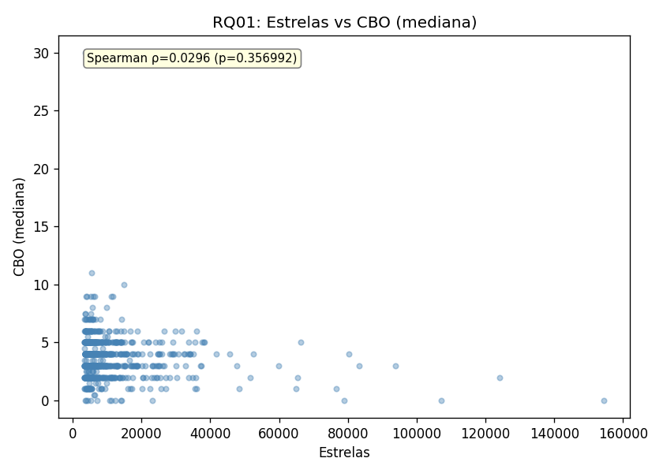
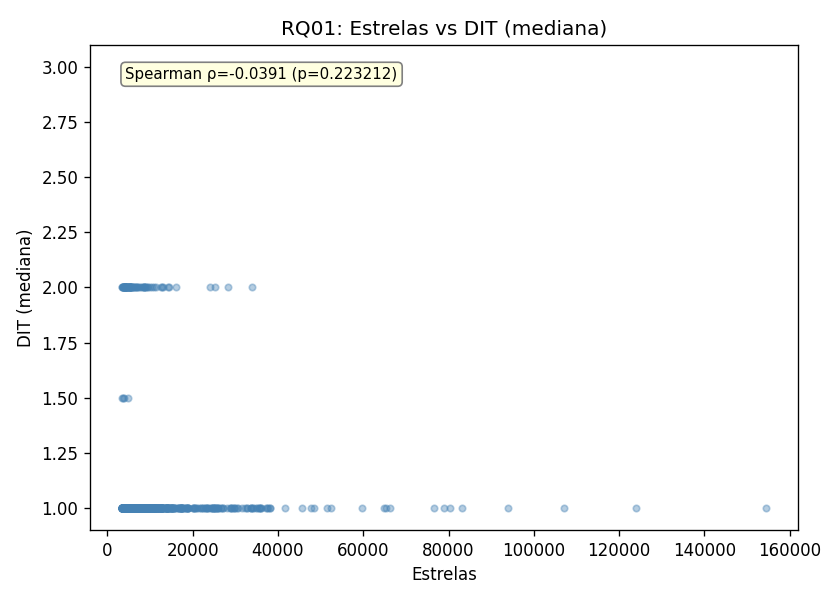
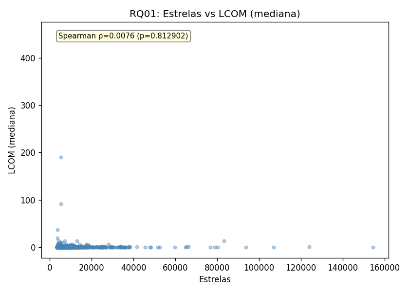

Os três gráficos de dispersão evidenciam a ausência de padrão entre o número de estrelas e as métricas de qualidade. Os valores de ρ próximos de zero (0,030 para CBO, −0,039 para DIT e 0,008 para LCOM) e os p-values superiores a 0,05 confirmam que não há correlação estatisticamente significativa em nenhum dos casos.

A hipótese de que projetos mais populares teriam melhor qualidade interna é **refutada**. Uma interpretação possível é que a popularidade no GitHub reflete visibilidade, utilidade prática ou apelo de marketing, não necessariamente a qualidade interna do código. Projetos amplamente estrelados podem ter código legado, frameworks amplamente adotados independentemente de sua arquitetura, ou mesmo repositórios de material educacional (tutoriais, exemplos) que não priorizam qualidade interna.

### 5.2 RQ02 — Maturidade vs Qualidade

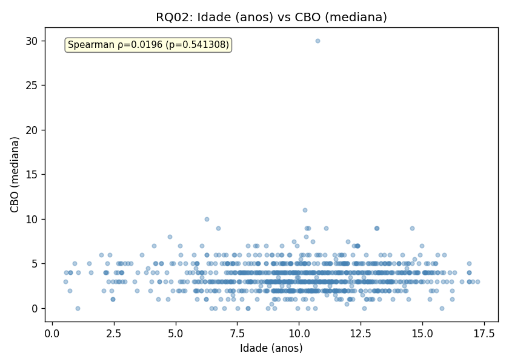
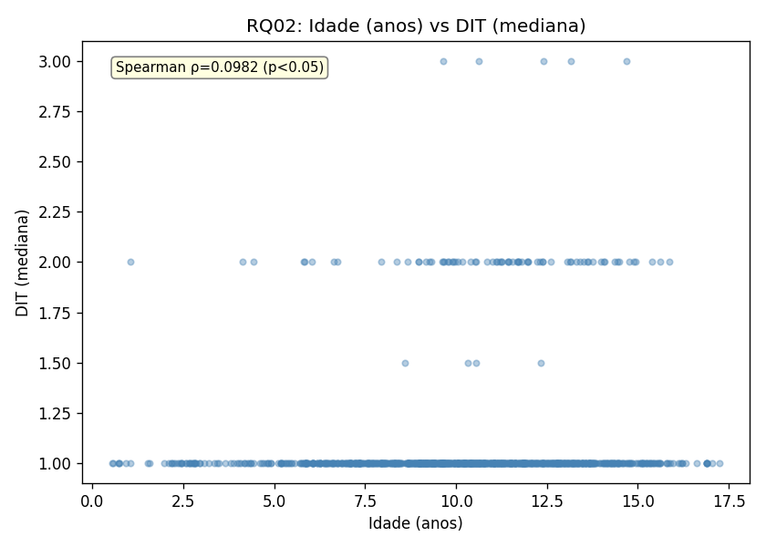
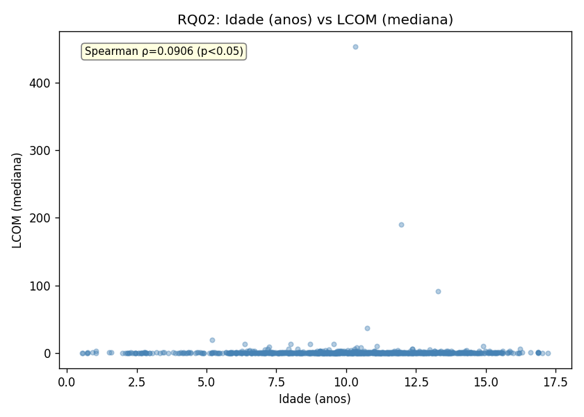

A correlação entre maturidade e CBO não foi significativa (ρ = 0,020, p = 0,54). No entanto, DIT (ρ = 0,098, p = 0,002) e LCOM (ρ = 0,091, p = 0,005) apresentaram correlações fracas mas significativas, no sentido positivo: projetos mais antigos tendem a ter hierarquias de herança ligeiramente mais profundas e menor coesão entre métodos.

A hipótese é **parcialmente confirmada**. A tendência de DIT crescer com a idade era esperada — projetos mais maduros naturalmente acumulam mais camadas de abstração ao longo do tempo. O aumento leve de LCOM sugere acúmulo gradual de dívida técnica, possivelmente por refatorações incompletas ao longo dos anos. Ainda assim, a força das correlações é baixa, indicando que a maturidade por si só não é um preditor forte de qualidade.

### 5.3 RQ03 — Atividade vs Qualidade


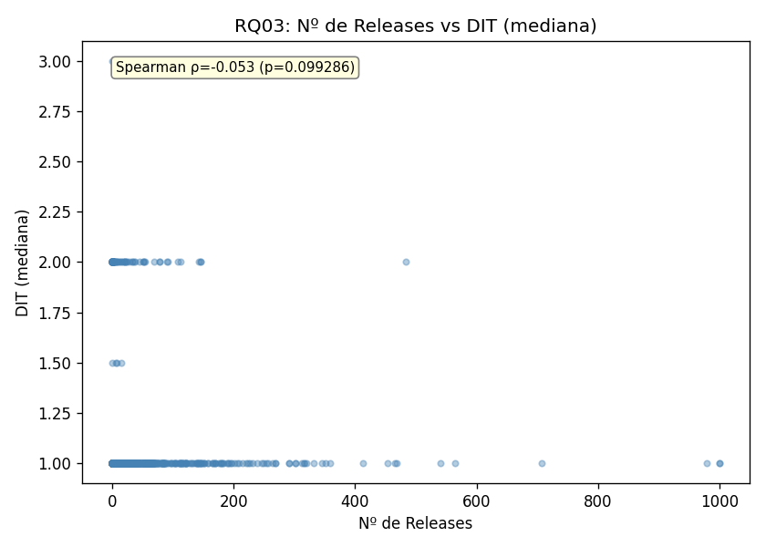
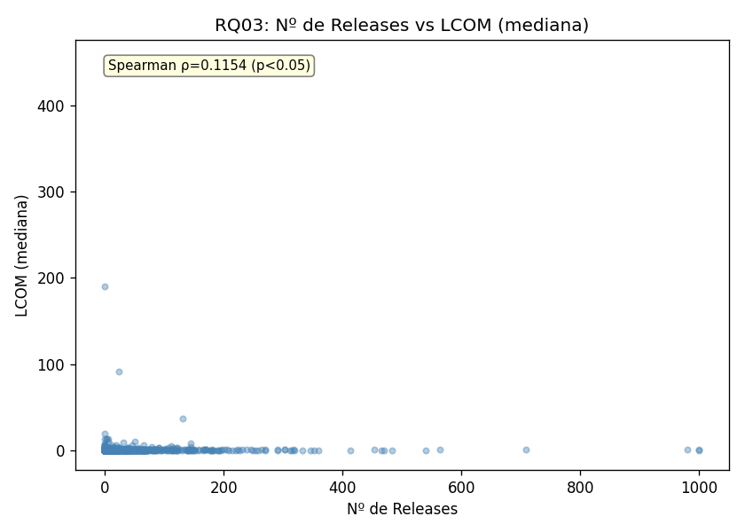

O número de releases apresentou correlação positiva e significativa com CBO (ρ = 0,287, p < 0,001) e com LCOM (ρ = 0,115, p = 0,0003). DIT não mostrou relação significativa.

A hipótese de que projetos mais ativos teriam melhor qualidade é **refutada**. O resultado sugere o oposto: projetos com mais releases tendem a ter mais acoplamento e menos coesão. Uma interpretação plausível é que projetos com muitos releases são, em geral, maiores e mais complexos — o que se reflete em CBO e LCOM elevados. A correlação moderada com CBO (ρ = 0,287) pode indicar que o crescimento funcional ao longo das releases introduce novas dependências entre classes sem necessariamente haver uma refatoração estrutural que as contenha.

### 5.4 RQ04 — Tamanho vs Qualidade

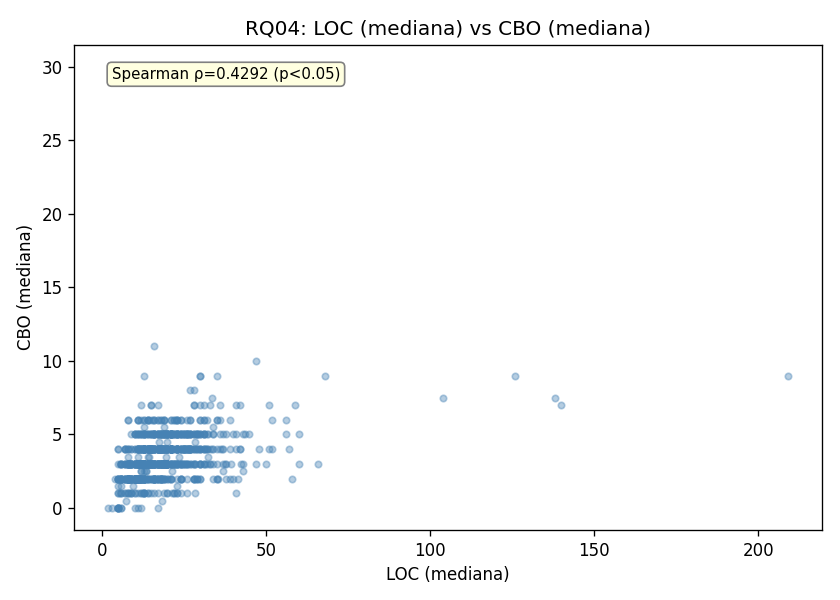
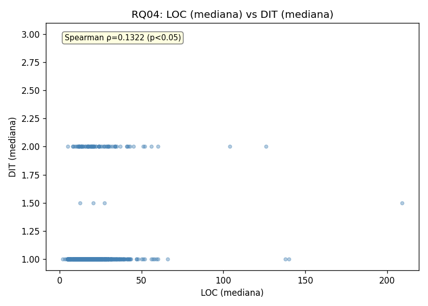
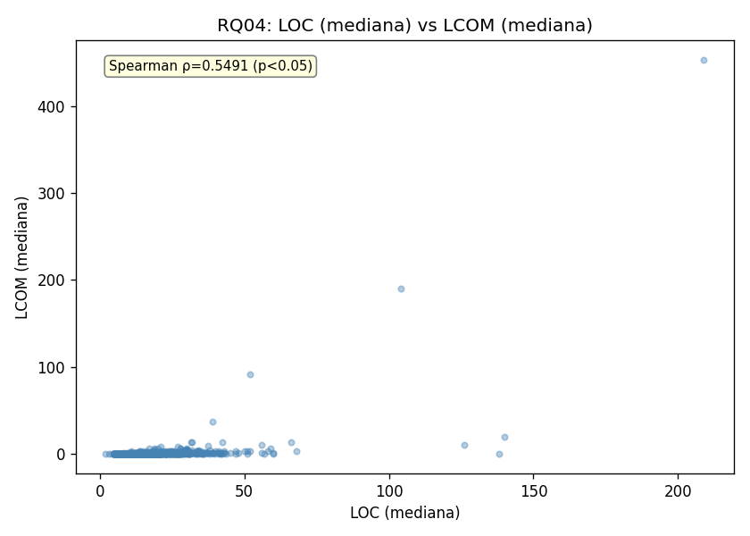

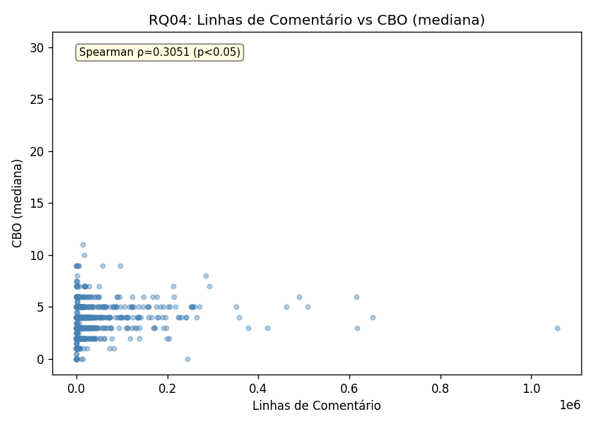
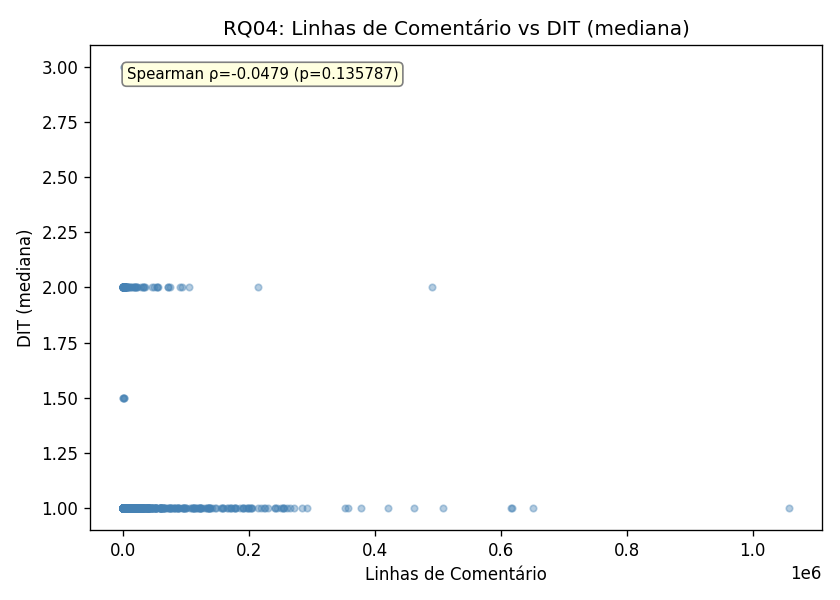
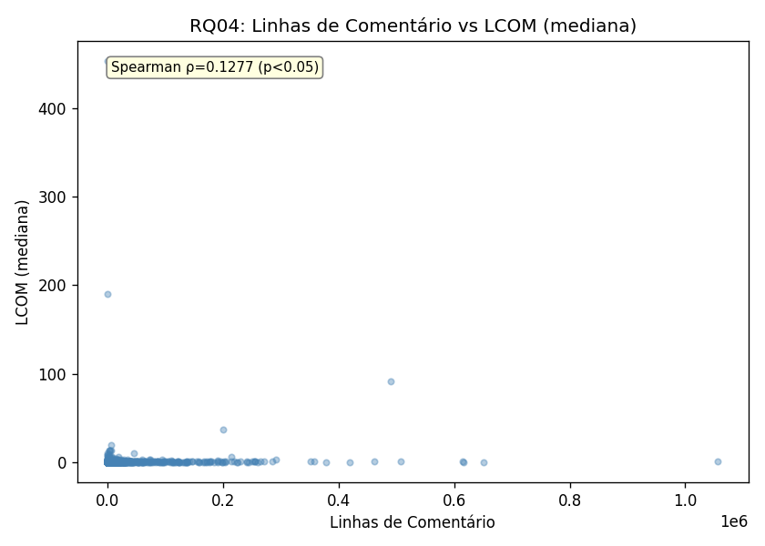

O tamanho apresentou as correlações mais fortes de todo o estudo. A correlação entre LOC e LCOM (ρ = 0,549) é moderada-forte e indica que classes maiores são substancialmente menos coesas — cada linha adicional de código tende a expandir as responsabilidades da classe sem uma divisão clara de papéis. A correlação de LOC com CBO (ρ = 0,429) é moderada: classes maiores também tendem a depender de mais outras classes.

As linhas de comentário reforçam o mesmo padrão para CBO (ρ = 0,305), mas com intensidade menor. A correlação de DIT com comentários não foi significativa, diferentemente de LOC, onde DIT apresentou ρ = 0,132 (p < 0,001).

A hipótese é **confirmada**: tamanho se correlaciona positivamente com complexidade estrutural. O resultado é intuitivo — classes longas naturalmente acumulam mais responsabilidades, dependências e ramificações de herança. O alto desvio padrão de linhas de comentário (dp = 75.268) indica grande heterogeneidade: alguns projetos comentam extensivamente (possivelmente documentação de API), enquanto a maioria mantém poucas linhas de comentário.

---

## 6. Conclusão

Os resultados obtidos permitem avaliar as quatro hipóteses formuladas:

| RQ | Hipótese | Resultado | Confirmada? |
|---|---|---|:---:|
| RQ01 | Maior popularidade → menor CBO e LCOM | Correlações negligenciáveis (ρ ≈ 0), não significativas | **Não** |
| RQ02 | Maior maturidade → DIT e LCOM ligeiramente maiores | DIT (ρ=0,098) e LCOM (ρ=0,091) significativos, CBO não | **Parcialmente** |
| RQ03 | Mais releases → melhor CBO e LCOM | CBO e LCOM aumentam com releases — sentido oposto à hipótese | **Não** |
| RQ04 | Maior tamanho → CBO e LCOM mais altos | LOC vs LCOM (ρ=0,549) e LOC vs CBO (ρ=0,429) — confirmado | **Sim** |

Os achados mais relevantes são: (1) **popularidade não implica qualidade interna** — estrelas medem visibilidade, não arquitetura; (2) **tamanho é o preditor mais forte de degradação de qualidade**, especialmente de coesão; (3) projetos mais ativos tendem a ser maiores e, por isso, exibem mais acoplamento; (4) maturidade introduz leve acúmulo de dívida técnica em DIT e LCOM, mas o efeito é fraco.

Como **limitações**, destaca-se a exclusão de repositórios que utilizam sintaxe Java 14+ incompatível com o CK 0.7.0 — projetos mais recentes e possivelmente mais bem estruturados podem estar sub-representados. Adicionalmente, a análise representa uma fotografia temporal dos repositórios no momento da coleta, e os resultados podem variar conforme a janela de tempo adotada.
